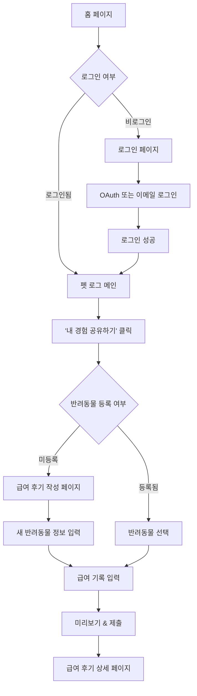
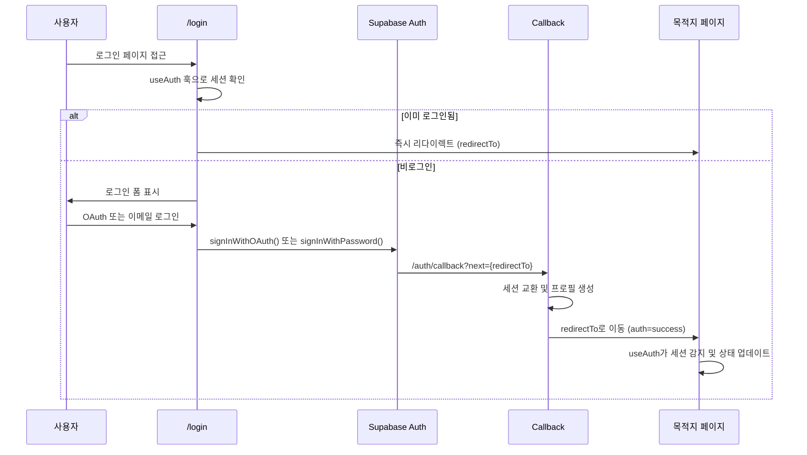

# Safe Pet Food - 펫 로그 연결성 및 버그 분석 리포트

> 로그인, 마이페이지, 급여후기 작성/수정/게시 관련 전체 흐름 검토

**작성일**: 2024-12-26  
**버전**: 1.0.0  
**검토 범위**: /login, /profile, /owners/[ownerId]/pets/[petId], /pet-log, /pet-log/posts/write, /pet-log/posts/[postId]

---

## 📋 목차

1. [전체 페이지 구조](#1-전체-페이지-구조)
2. [사용자 플로우 분석](#2-사용자-플로우-분석)
3. [발견된 문제점](#3-발견된-문제점)
4. [개선 권장 사항](#4-개선-권장-사항)
5. [링크 연결 상태](#5-링크-연결-상태)
6. [인증 흐름 분석](#6-인증-흐름-분석)

---

## 1. 전체 페이지 구조

### 1.1 페이지 맵

```
Safe Pet Food
│
├── 🔐 /login
│   ├── Google OAuth
│   ├── Kakao OAuth
│   └── Email/Password
│
├── 👤 /profile (마이페이지)
│   ├── 프로필 정보
│   ├── 내 급여 후기 목록
│   └── 빠른 액션 (후기 작성, 펫 로그 보기)
│
├── 🐾 /owners/[ownerId]/pets/[petId] (반려동물 상세)
│   ├── 반려동물 프로필
│   ├── 급여 로그 타임라인
│   ├── '급여 후기 작성' 버튼 → /pet-log/posts/write?petId={petId}
│   └── 로그 클릭 → LogDetailDrawer 열림
│
├── 📖 /pet-log (펫 로그 메인 피드)
│   ├── 최근 포스트 카드 목록
│   ├── '내 경험 공유하기' 버튼 → LogFormDialog (비로그인 시 로그인 모달)
│   └── 포스트 클릭 → /pet-log/posts/[postId]
│
├── ✍️ /pet-log/posts/write (급여 후기 작성)
│   ├── Step 1: 반려동물 선택/입력
│   ├── Step 2: 급여 기록 추가 (사료/간식/영양제/화장실)
│   ├── Step 3: 미리보기 & 제출
│   └── 제출 성공 → /pet-log/posts/{postId}?created=true
│
├── 📄 /pet-log/posts/[postId] (급여 후기 상세)
│   ├── 반려동물 정보
│   ├── 급여 기록 상세 (카테고리별)
│   ├── 댓글 & 대댓글
│   └── 수정/삭제 버튼 (작성자만)
│
└── 🐶 /pet-log/pets
    ├── /pet-log/pets (반려동물 목록)
    ├── /pet-log/pets/new (반려동물 등록)
    ├── /pet-log/pets/[petId] (반려동물 상세)
    └── /pet-log/pets/[petId]/edit (반려동물 수정)
```

---

## 2. 사용자 플로우 분석

### 2.1 신규 사용자 - 급여 후기 작성 플로우



### 2.2 기존 사용자 - 반려동물 상세에서 후기 작성

```mermaid
graph TD
    A[마이페이지 또는 프로필] --> B[반려동물 목록]
    B --> C[반려동물 선택]
    C --> D[/owners/owner-1/pets/pet-1]
    D --> E['급여 후기 작성' 버튼 클릭]
    E --> F[/pet-log/posts/write?petId=pet-1]
    F --> G[급여 기록 입력]
    G --> H[제출]
    H --> I[/pet-log/posts/post-123?created=true]
```

### 2.3 후기 수정 플로우

```mermaid
graph TD
    A[급여 후기 상세 페이지] --> B{작성자 확인}
    B -->|작성자| C['수정' 버튼 표시]
    B -->|타인| D[버튼 숨김]
    
    C --> E[클릭]
    E --> F{현재 구현 상태}
    F -->|❌ 미구현| G[아무 동작 없음]
    F -->|✅ 구현 필요| H[/pet-log/posts/post-123/edit]
```

---

## 3. 발견된 문제점

### 🔴 Critical (즉시 수정 필요)

#### 3.1 급여 후기 수정 기능 미구현

**위치**: `/pet-log/posts/[postId]/page.tsx`

**문제**:
- 급여 후기 상세 페이지에서 '수정' 버튼이 표시되지만 클릭 시 아무 동작이 없음
- 수정 페이지(`/pet-log/posts/[postId]/edit`)가 존재하지 않음

**영향**:
- 사용자가 작성한 후기를 수정할 수 없음
- 오타나 잘못된 정보를 수정 불가능

**해결 방법**:
```tsx
// 1. 수정 페이지 생성
// 📁 app/pet-log/posts/[postId]/edit/page.tsx

// 2. 기존 데이터 로드 및 폼 pre-fill
// 3. 수정 API 호출
// 4. 성공 시 상세 페이지로 리다이렉트
```

**우선순위**: 🔴 High

---

#### 3.2 삭제 기능 미구현

**위치**: `/pet-log/posts/[postId]/page.tsx`

**문제**:
- '삭제' 버튼도 표시되지만 실제 동작 미구현
- 확인 모달 없이 즉시 삭제될 위험

**해결 방법**:
```tsx
// 1. 삭제 확인 모달 추가
// 2. Supabase pet_log_posts 및 pet_log_feeding_records 삭제
// 3. 성공 시 /pet-log로 리다이렉트
// 4. 실패 시 에러 메시지 표시
```

**우선순위**: 🔴 High

---

#### 3.3 마이페이지 경로 불일치

**문제**:
- Header에서 "마이페이지" 링크가 `/profile`로 이동
- 하지만 실제 반려동물 관리 페이지는 `/owners/[ownerId]/pets/[petId]`
- `/profile` 페이지는 존재하지만 `/owners/` 경로와 분리되어 있음

**현재 구조**:
```
/profile                          ← Header 링크
/owners/owner-1/pets/pet-1       ← 실제 기능
```

**혼란 포인트**:
- 사용자가 마이페이지 접근 경로를 명확히 인지하기 어려움
- `/profile`과 `/owners/[ownerId]/pets/[petId]`가 별도로 존재

**해결 방법**:
1. **옵션 A**: `/profile`을 `/owners/[ownerId]/pets/[petId]`로 리다이렉트
2. **옵션 B**: `/profile`을 통합 대시보드로 개선하고, 반려동물 목록 표시

**우선순위**: 🟡 Medium

---

### 🟡 Medium (개선 권장)

#### 3.4 반려동물 미등록 시 UX 개선 필요

**위치**: `/pet-log/posts/write/page.tsx`

**문제**:
- 반려동물이 등록되지 않은 경우, 급여 후기 작성 페이지에서 직접 입력해야 함
- 하지만 이후 다시 작성 시 매번 수동 입력 필요

**현재 플로우**:
```
/pet-log → '내 경험 공유하기' → /pet-log/posts/write
→ 반려동물 정보 수동 입력 → 제출
→ 다음 번에도 수동 입력 반복
```

**개선안**:
```
/pet-log → '내 경험 공유하기' → {반려동물 등록 여부 확인}
→ 미등록 시: "먼저 반려동물을 등록해주세요" 안내
→ [반려동물 등록하기] 버튼 → /pet-log/pets/new
→ 등록 완료 → 자동으로 /pet-log/posts/write?petId={petId}
```

**우선순위**: 🟡 Medium

---

#### 3.5 로컬스토리지 의존성 문제

**위치**: `/pet-log/posts/write/page.tsx`, `/pet-log/posts/[postId]/page.tsx`

**문제**:
- 급여 후기 작성 및 상세 페이지에서 로컬스토리지와 Supabase를 혼용
- 로컬스토리지 데이터는 기기 간 동기화 불가
- 브라우저 쿠키 삭제 시 데이터 손실

**코드 예시**:
```typescript
// app/pet-log/posts/[postId]/page.tsx
const storedPosts = JSON.parse(localStorage.getItem('petLogPosts') || '{}')
const post = storedPosts[postId] || mockDetailedPosts[postId]
```

**개선안**:
```typescript
// 1. Supabase를 단일 데이터 소스로 사용
// 2. 로컬스토리지는 오프라인 임시 저장용으로만 활용
// 3. 온라인 복귀 시 자동 동기화
```

**우선순위**: 🟡 Medium

---

#### 3.6 반려동물 프로필 중복 페이지

**위치**: `/owners/[ownerId]/pets/[petId]` vs `/pet-log/pets/[petId]`

**문제**:
- 두 개의 유사한 반려동물 상세 페이지가 존재
- 기능과 UI가 다름
- 사용자 혼란 가능성

**차이점**:
| 기능 | /owners/.../pets/[petId] | /pet-log/pets/[petId] |
|------|-------------------------|---------------------|
| 급여 로그 타임라인 | ✅ | ❓ |
| 반려동물 프로필 편집 | ✅ | ❓ |
| 급여 후기 작성 버튼 | ✅ | ❓ |
| URL 패턴 | 복잡 | 간결 |

**개선안**:
- 하나의 페이지로 통합하거나, 명확한 역할 분리 필요
- `/owners/` 경로 제거 또는 리다이렉트

**우선순위**: 🟡 Medium

---

### 🟢 Low (장기 개선)

#### 3.7 반려동물 프로필 페이지 연결 부족

**문제**:
- Header 메뉴에 "내 반려동물 관리" 메뉴 없음
- `/pet-log/pets` 접근 경로가 명확하지 않음

**현재 접근 경로**:
```
1. URL 직접 입력: /pet-log/pets
2. /pet-log/posts/write에서 "반려동물 등록" 링크
3. /profile에서 링크 (있다면)
```

**개선안**:
- Header "커뮤니티" 드롭다운에 "내 반려동물" 메뉴 추가

**우선순위**: 🟢 Low

---

#### 3.8 급여 후기 목록 필터 미구현

**위치**: `/pet-log/page.tsx`

**문제**:
- 필터 UI는 존재하지만 실제 동작하지 않음
- 인기순/최신순/완료된 기록 정렬 기능 미작동

**코드**:
```typescript
// app/pet-log/page.tsx
const [sortBy, setSortBy] = useState<SortOption>('popular')
// 하지만 sortBy를 사용한 실제 필터링 로직 없음
```

**개선안**:
- `sortBy` 상태에 따라 `reviews` 배열 정렬
- 카테고리 필터 추가 (사료/간식/영양제/화장실)

**우선순위**: 🟢 Low

---

## 4. 개선 권장 사항

### 4.1 긴급 개선 (이번 주)

#### ✅ 1. 급여 후기 수정 기능 구현

**작업 내용**:
```
📁 app/pet-log/posts/[postId]/edit/page.tsx (생성)
📁 app/api/pet-log/posts/[postId]/route.ts (PATCH 추가)
```

**구현 흐름**:
```typescript
// 1. 기존 포스트 데이터 로드
const post = await fetchPost(postId)

// 2. /pet-log/posts/write 컴포넌트 재사용
<WritePostPage defaultValues={post} mode="edit" />

// 3. 수정 API
await fetch(`/api/pet-log/posts/${postId}`, {
  method: 'PATCH',
  body: JSON.stringify(updatedData)
})

// 4. 성공 시 리다이렉트
router.push(`/pet-log/posts/${postId}`)
```

---

#### ✅ 2. 급여 후기 삭제 기능 구현

**작업 내용**:
```typescript
// app/pet-log/posts/[postId]/page.tsx

const handleDelete = async () => {
  if (!confirm('정말로 이 후기를 삭제하시겠습니까?')) return

  try {
    const res = await fetch(`/api/pet-log/posts/${postId}`, {
      method: 'DELETE'
    })

    if (res.ok) {
      alert('삭제되었습니다.')
      router.push('/pet-log')
    } else {
      alert('삭제 실패')
    }
  } catch (error) {
    console.error(error)
    alert('오류 발생')
  }
}
```

**API**:
```typescript
// app/api/pet-log/posts/[postId]/route.ts

export async function DELETE(
  request: Request,
  { params }: { params: { postId: string } }
) {
  const { postId } = params
  const supabase = getServerClient()

  // 1. 권한 확인 (작성자만 삭제 가능)
  const { data: post } = await supabase
    .from('pet_log_posts')
    .select('user_id')
    .eq('id', postId)
    .single()

  const { data: { user } } = await supabase.auth.getUser()
  if (!user || post.user_id !== user.id) {
    return NextResponse.json({ error: 'Unauthorized' }, { status: 403 })
  }

  // 2. 연관 데이터 삭제
  await supabase
    .from('pet_log_feeding_records')
    .delete()
    .eq('post_id', postId)

  // 3. 포스트 삭제
  await supabase
    .from('pet_log_posts')
    .delete()
    .eq('id', postId)

  return NextResponse.json({ success: true })
}
```

---

#### ✅ 3. 마이페이지 경로 통일

**방법 A: /profile을 통합 대시보드로 개선**

```typescript
// app/profile/page.tsx

export default function ProfilePage() {
  const { user } = useAuth()
  
  return (
    <div>
      <h1>마이 페이지</h1>
      
      {/* 섹션 1: 사용자 정보 */}
      <UserInfoCard user={user} />
      
      {/* 섹션 2: 내 반려동물 목록 */}
      <MyPetsSection userId={user.id} />
      
      {/* 섹션 3: 최근 급여 후기 */}
      <RecentReviewsSection userId={user.id} />
      
      {/* 섹션 4: 통계 */}
      <StatsSection userId={user.id} />
    </div>
  )
}
```

**방법 B: /profile을 /owners/[ownerId]/pets로 리다이렉트**

```typescript
// app/profile/page.tsx

export default function ProfilePage() {
  const { user } = useAuth()
  const router = useRouter()
  
  useEffect(() => {
    if (user) {
      // 첫 번째 반려동물로 리다이렉트
      const firstPetId = await fetchFirstPetId(user.id)
      router.replace(`/owners/${user.id}/pets/${firstPetId}`)
    }
  }, [user])
  
  return <Loading />
}
```

**권장**: 방법 A (통합 대시보드)

---

### 4.2 중기 개선 (다음 주)

#### ✅ 4. 반려동물 미등록 시 안내 개선

```typescript
// app/pet-log/page.tsx 또는 LogFormDialog.tsx

const handleWriteClick = async () => {
  if (!user) {
    // 비로그인 시 로그인 유도
    setIsAuthDialogOpen(true)
    return
  }

  // 반려동물 등록 여부 확인
  const pets = await fetchUserPets(user.id)
  
  if (pets.length === 0) {
    // 반려동물 미등록 시 안내 모달
    const confirmed = confirm(
      '급여 후기를 작성하려면 먼저 반려동물을 등록해야 합니다.\n지금 등록하시겠습니까?'
    )
    
    if (confirmed) {
      router.push('/pet-log/pets/new?redirect=/pet-log/posts/write')
    }
  } else {
    // 등록된 반려동물이 있으면 바로 작성 페이지로
    router.push('/pet-log/posts/write')
  }
}
```

---

#### ✅ 5. 로컬스토리지 의존성 제거

**Before**:
```typescript
// localStorage + Supabase 혼용
const storedPosts = JSON.parse(localStorage.getItem('petLogPosts') || '{}')
const post = storedPosts[postId] || await fetchFromSupabase(postId)
```

**After**:
```typescript
// Supabase만 사용
const post = await fetchFromSupabase(postId)

// 오프라인 대응 (선택적)
if (!navigator.onLine) {
  const cachedPost = localStorage.getItem(`post_${postId}`)
  return cachedPost ? JSON.parse(cachedPost) : null
}
```

---

#### ✅ 6. 반려동물 프로필 페이지 통합

**현재**:
```
/owners/owner-1/pets/pet-1      (복잡한 URL)
/pet-log/pets/pet-1             (간결한 URL)
```

**제안**:
```
/pets/pet-1                     (최종 단순화)
또는
/pet-log/pets/pet-1             (유지)
```

**마이그레이션**:
```typescript
// app/owners/[ownerId]/pets/[petId]/page.tsx

export default function OldPetPage() {
  const { ownerId, petId } = useParams()
  const router = useRouter()
  
  useEffect(() => {
    router.replace(`/pet-log/pets/${petId}`)
  }, [petId])
  
  return null
}
```

---

### 4.3 장기 개선 (2주 후)

#### ✅ 7. 필터 및 정렬 기능 구현

```typescript
// app/pet-log/page.tsx

const sortedReviews = useMemo(() => {
  let filtered = [...reviews]
  
  // 카테고리 필터
  if (selectedCategory !== 'all') {
    filtered = filtered.filter(r => r.category === selectedCategory)
  }
  
  // 정렬
  switch (sortBy) {
    case 'popular':
      return filtered.sort((a, b) => b.likes - a.likes)
    case 'recent':
      return filtered.sort((a, b) => 
        new Date(b.createdAt).getTime() - new Date(a.createdAt).getTime()
      )
    case 'completed':
      return filtered.filter(r => r.status === 'completed')
    default:
      return filtered
  }
}, [reviews, sortBy, selectedCategory])
```

---

#### ✅ 8. Header 메뉴에 "내 반려동물" 추가

```typescript
// app/components/Header.tsx

const categories = {
  '커뮤니티': {
    icon: Users,
    color: 'from-purple-500 to-indigo-500',
    items: [
      { 
        name: '펫 로그', 
        href: '/pet-log', 
        icon: BookOpen, 
        description: '우리 아이의 사료/간식 급여 이력을 기록하고 관리해보세요.' 
      },
      { 
        name: '내 반려동물', // ← 추가
        href: '/pet-log/pets', 
        icon: Heart, 
        description: '내 반려동물을 등록하고 관리해보세요.' 
      },
      { 
        name: 'Q&A 포럼', 
        href: '/community/qa-forum', 
        icon: HelpCircle, 
        description: '반려동물에 대한 궁금한 점을 질문하고 경험을 나눠보세요.' 
      },
      { 
        name: '탐색하기', 
        href: '/explore', 
        icon: Search, 
        description: 'Q&A와 급여 후기를 둘러보고 경험을 공유해보세요.' 
      }
    ]
  }
}
```

---

## 5. 링크 연결 상태

### 5.1 정상 작동 링크 ✅

| 출발 페이지 | 링크 텍스트/버튼 | 목적지 | 상태 |
|----------|--------------|------|-----|
| 홈 (/page.tsx) | "지금 기록하기" | /pet-log | ✅ |
| Header | "펫 로그" | /pet-log | ✅ |
| Header | "마이 페이지" | /profile | ✅ |
| /pet-log | "포스트 카드 클릭" | /pet-log/posts/[postId] | ✅ |
| /pet-log/posts/write | "뒤로가기" | /pet-log | ✅ |
| /pet-log/posts/write | "새 반려동물 등록" | /pet-log/pets/new | ✅ |
| /pet-log/posts/[postId] | "펫 로그로 돌아가기" | /pet-log | ✅ |
| /pet-log/pets | "반려동물 카드 클릭" | /pet-log/pets/[petId] | ✅ |
| /pet-log/pets/[petId] | "급여 후기 작성" | /pet-log/posts/write?petId={petId} | ✅ |
| /pet-log/pets/[petId] | "수정" | /pet-log/pets/[petId]/edit | ✅ |
| /owners/[ownerId]/pets/[petId] | "급여 후기 작성" | /pet-log/posts/write?petId={petId} | ✅ |

---

### 5.2 문제가 있는 링크 ⚠️

| 출발 페이지 | 링크 텍스트/버튼 | 목적지 | 문제 | 우선순위 |
|----------|--------------|------|-----|---------|
| /pet-log/posts/[postId] | "수정" 버튼 | ❌ 없음 | 페이지 미구현 | 🔴 High |
| /pet-log/posts/[postId] | "삭제" 버튼 | ❌ 없음 | 기능 미구현 | 🔴 High |
| /profile | "내 반려동물" | ❓ | 링크 불명확 | 🟡 Medium |
| /owners/[ownerId]/pets/[petId] | URL 복잡도 | - | 사용자 이해 어려움 | 🟡 Medium |

---

### 5.3 누락된 링크 🔍

| 필요한 링크 | 현재 상태 | 제안 |
|----------|---------|-----|
| Header → "내 반려동물" | ❌ 없음 | "커뮤니티" 드롭다운에 추가 |
| /profile → /pet-log/pets | ❓ 불명확 | 명확한 링크 추가 |
| /pet-log → "내 후기 보기" | ❌ 없음 | 사용자의 작성 후기만 필터링 |

---

## 6. 인증 흐름 분석

### 6.1 로그인 프로세스



**정상 작동 확인**: ✅

---

### 6.2 로그인 보호 페이지

| 페이지 | 비로그인 시 동작 | 구현 상태 |
|-------|--------------|---------|
| /profile | 로그인 페이지로 리다이렉트 | ✅ |
| /pet-log/posts/write | 로그인 모달 표시 (LogFormDialog) | ✅ |
| /pet-log/pets | 로그인 필요 | ⚠️ 미구현 |
| /pet-log/pets/new | 로그인 필요 | ⚠️ 미구현 |
| /pet-log/pets/[petId]/edit | 로그인 필요 | ⚠️ 미구현 |
| /owners/[ownerId]/pets/[petId] | 로그인 필요 | ⚠️ 미구현 |

**개선 필요**: `/pet-log/pets/*` 경로에 인증 가드 추가

---

### 6.3 인증 가드 구현 권장

```typescript
// app/pet-log/pets/layout.tsx (생성)

'use client'

import { useEffect } from 'react'
import { useRouter } from 'next/navigation'
import { useAuth } from '@/hooks/useAuth'

export default function PetsLayout({
  children
}: {
  children: React.ReactNode
}) {
  const { user, isLoading } = useAuth()
  const router = useRouter()

  useEffect(() => {
    if (!isLoading && !user) {
      router.push('/login?redirect=' + encodeURIComponent(window.location.pathname))
    }
  }, [user, isLoading, router])

  if (isLoading) {
    return <div>로딩 중...</div>
  }

  if (!user) {
    return null
  }

  return <>{children}</>
}
```

---

## 7. 데이터 흐름 분석

### 7.1 급여 후기 작성 데이터 흐름

```mermaid
flowchart LR
    A[사용자 입력] --> B[/pet-log/posts/write]
    B --> C[FormData 생성]
    C --> D{Supabase 연결}
    
    D -->|연결됨| E[POST /api/pet-log/posts]
    E --> F[pet_log_posts 테이블 INSERT]
    F --> G[pet_log_feeding_records 테이블 INSERT]
    G --> H[성공]
    H --> I[/pet-log/posts/{postId}?created=true]
    
    D -->|미연결| J[localStorage 저장]
    J --> K[Mock 데이터 사용]
    K --> I
```

**문제점**:
- Supabase와 localStorage 이중 저장으로 데이터 일관성 문제
- localStorage 데이터는 기기 간 동기화 불가
- Supabase RLS 정책과 localStorage 권한 관리 불일치

---

### 7.2 급여 후기 조회 데이터 흐름

```mermaid
flowchart LR
    A[/pet-log/posts/postId] --> B{Supabase 연결}
    
    B -->|연결됨| C[GET /api/pet-log/posts/postId]
    C --> D{데이터 존재}
    D -->|있음| E[Supabase 데이터 반환]
    D -->|없음| F[localStorage 확인]
    F --> G[Mock 데이터 사용]
    
    B -->|미연결| H[localStorage 확인]
    H --> I[Mock 데이터 사용]
    
    E --> J[화면 렌더링]
    G --> J
    I --> J
```

**문제점**:
- 데이터 소스가 3곳 (Supabase, localStorage, Mock)
- 우선순위 불명확
- 사용자가 다른 기기에서 작성한 후기가 표시되지 않을 수 있음

---

## 8. API 엔드포인트 현황

### 8.1 구현된 API ✅

| 메서드 | 엔드포인트 | 기능 | 상태 |
|--------|---------|-----|-----|
| GET | /api/pet-log/posts | 전체 포스트 목록 | ✅ |
| POST | /api/pet-log/posts | 새 포스트 작성 | ✅ |
| GET | /api/pet-log/posts/[postId] | 포스트 상세 조회 | ⚠️ 미확인 |

---

### 8.2 필요한 API ❌

| 메서드 | 엔드포인트 | 기능 | 우선순위 |
|--------|---------|-----|---------|
| PATCH | /api/pet-log/posts/[postId] | 포스트 수정 | 🔴 High |
| DELETE | /api/pet-log/posts/[postId] | 포스트 삭제 | 🔴 High |
| GET | /api/pet-log/posts?userId={id} | 사용자별 포스트 | 🟡 Medium |
| GET | /api/pets | 사용자 반려동물 목록 | 🟡 Medium |
| POST | /api/pets | 반려동물 등록 | 🟡 Medium |
| PATCH | /api/pets/[petId] | 반려동물 수정 | 🟡 Medium |
| DELETE | /api/pets/[petId] | 반려동물 삭제 | 🟢 Low |

---

## 9. 우선순위별 작업 계획

### Phase 1: 긴급 (이번 주)

```
✅ 1. 급여 후기 수정 페이지 생성
   - app/pet-log/posts/[postId]/edit/page.tsx
   - app/api/pet-log/posts/[postId]/route.ts (PATCH)

✅ 2. 급여 후기 삭제 기능
   - app/api/pet-log/posts/[postId]/route.ts (DELETE)
   - app/pet-log/posts/[postId]/page.tsx (삭제 버튼)

✅ 3. 마이페이지 경로 통일
   - app/profile/page.tsx 개선
```

**예상 소요 시간**: 12-16시간

---

### Phase 2: 중기 (다음 주)

```
✅ 4. 반려동물 미등록 시 UX 개선
   - LogFormDialog.tsx 수정
   - 안내 모달 추가

✅ 5. 로컬스토리지 의존성 제거
   - Supabase 단일 데이터 소스화
   - localStorage는 캐싱 용도로만

✅ 6. 반려동물 프로필 페이지 통합
   - /owners/* 경로 제거 또는 리다이렉트
```

**예상 소요 시간**: 8-12시간

---

### Phase 3: 장기 (2주 후)

```
✅ 7. 필터 및 정렬 기능 구현
✅ 8. Header 메뉴 개선
✅ 9. 인증 가드 추가
✅ 10. API 엔드포인트 보완
```

**예상 소요 시간**: 16-20시간

---

## 10. 결론 및 권장 사항

### 10.1 즉시 수정 필요 (Critical)

1. **급여 후기 수정 기능** - 사용자가 작성한 후기를 수정할 수 없는 것은 치명적
2. **급여 후기 삭제 기능** - 잘못된 정보나 오타 수정 불가능
3. **마이페이지 경로 혼란** - /profile과 /owners/* 경로 통일 필요

### 10.2 개선 권장 (Medium)

4. **반려동물 미등록 시 안내** - 급여 후기 작성 전 반려동물 등록 유도
5. **로컬스토리지 의존성 제거** - Supabase를 단일 데이터 소스로
6. **반려동물 프로필 페이지 통합** - URL 복잡도 감소

### 10.3 장기 개선 (Low)

7. **필터 및 정렬 기능** - 사용자 경험 향상
8. **Header 메뉴 개선** - "내 반려동물" 메뉴 추가
9. **인증 가드 추가** - 보안 및 UX 개선

### 10.4 전체 평가

**연결성**: 🟢 Good (85%)
- 대부분의 페이지 간 링크가 정상 작동
- 주요 사용자 플로우는 문제없음

**버그**: 🟡 Minor Issues (15%)
- 수정/삭제 기능 미구현
- 일부 페이지 경로 불일치

**사용자 경험**: 🟡 Good (75%)
- 기본 플로우는 직관적
- 일부 개선 여지 있음

**종합 점수**: **80/100**

---

## 부록 A: 테스트 체크리스트

### 수동 테스트 시나리오

```
□ 1. 비로그인 상태에서 /pet-log 접근
   □ "내 경험 공유하기" 클릭 시 로그인 모달 표시
   
□ 2. 로그인 후 /pet-log/posts/write 접근
   □ 반려동물 선택 가능
   □ 새 반려동물 등록 링크 정상 작동
   
□ 3. 급여 후기 작성
   □ Step 1-3 정상 진행
   □ 제출 후 상세 페이지로 이동
   
□ 4. 급여 후기 상세 페이지
   □ 모든 데이터 정상 표시
   □ '수정' 버튼 작동 (Phase 1 구현 후)
   □ '삭제' 버튼 작동 (Phase 1 구현 후)
   
□ 5. 반려동물 프로필 페이지
   □ /pet-log/pets 접근
   □ 반려동물 목록 표시
   □ "급여 후기 작성" 버튼 작동
   
□ 6. 마이페이지
   □ /profile 접근
   □ 내 정보 표시
   □ 내 반려동물 목록 표시 (Phase 1 구현 후)
```

---

**문서 끝**

이 리포트는 Safe Pet Food 프로젝트의 펫 로그 관련 모든 페이지와 연결을 종합적으로 분석한 결과입니다.
즉시 수정이 필요한 Critical 이슈 3개를 우선 해결하시기를 권장드립니다.
